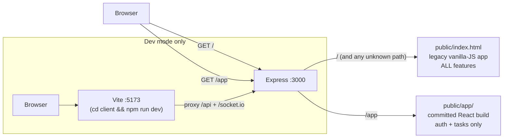

# Onboarding Guide

Welcome! This is the "day 1" doc. Read this before anything else — it explains
the one thing that confuses every newcomer, then walks you through the
codebase the way a request actually flows through it.

## 1. The one thing to understand first: there are TWO frontends



- The **legacy vanilla-JS app** (`public/index.html` + `public/js/` + `public/app.js`, ~10k lines)
  is the **production UI**. It covers everything: tasks, notes, dashboard,
  transactions, credit cards, admin, exports. Served at `/` by
  `express.static(public)` plus a `*` fallback (see `setupStaticFiles` /
  `setupFallbackRoute` in [src/server/bootstrap/middleware.js](../src/server/bootstrap/middleware.js)).
- The **React app** (`client/src/`) is an **incremental rewrite** covering only
  auth + tasks. `client/vite.config.ts` sets `base: '/app/'` and builds into
  `public/app/` — that build output is **committed to git** so the Express
  server can serve it with zero extra config.

Most UI work happens in the legacy app. Don't let the React folder fool you.

## 2. Setup in 10 minutes

Follow [QUICK_START.md](../QUICK_START.md). Gotchas the guide glosses over:

- **PostgreSQL and Redis must both be running** before `npm run dev`; the
  server waits on them.
- **Migrations run automatically** on server start (`src/server/db/initialize.js`) —
  there is no separate migrate command.
- The initial admin account password comes from the `DEFAULT_ADMIN_PASSWORD`
  env var.

## 3. Backend request lifecycle — trace one real request

What happens when the UI saves a task (`PUT /api/tasks/:id`):

1. [server.js](../server.js) — entry point; waits for `dbReady`, starts the HTTP server.
2. [app.js](../app.js) — builds the middleware pipeline, in order:
   JSON body parsing → Pino request logging → session (express-session, stored
   in Postgres) → **cache invalidation** (on any mutating `/api` request, the
   user's Redis cache is cleared after the response finishes) → database-ready
   check.
3. [src/server/bootstrap/routes.js](../src/server/bootstrap/routes.js) — the route
   registry. Injects dependencies (`allAsync`, `getAsync`, `runAsync`,
   middleware, email senders, ...) into each router factory.
   **Note the mixed mounting**: tasks/dashboard/notes/admin/auth routers mount
   at `/api` and declare full subpaths internally; credit-cards and
   transactions mount at `/api/credit-cards` / `/api/transactions`.
4. [src/server/routes/tasks.routes.js](../src/server/routes/tasks.routes.js) —
   validates the request and calls the service.
5. [src/server/services/tasks.service.js](../src/server/services/tasks.service.js) —
   business logic; talks to Postgres through the injected query helpers from
   [src/server/db/client.js](../src/server/db/client.js).
6. Side effects on the way out: the cache-invalidation middleware clears the
   user's Redis cache, and the route emits a Socket.IO event via
   [src/server/realtime.js](../src/server/realtime.js) (`emitToUser`) so other
   open tabs/devices update live.

The same shape applies to every resource: **route → service → db**, with
dependencies injected as factory arguments rather than imported.

## 4. The legacy frontend module factory pattern

Every feature in the legacy app is an IIFE that registers a factory on
`window`, and [public/app.js](../public/app.js) wires them together. From
[public/js/features/admin/admin.module.js](../public/js/features/admin/admin.module.js):

```js
(function () {
  // Admin feature: user management, impersonation, and the audit log.
  const create = ({
    request,           // authenticated fetch wrapper
    t,                 // i18n translate
    showStatusToast,   // toast helper
    getCurrentUser, setCurrentUser,
    setCurrentView, showSection,
    // ...every dependency is injected, nothing is imported
  }) => {
    // ---- DOM refs (owned by this module) ----
    const userList = document.getElementById('user-list');
    // ---- State (owned by this module) ----
    let users = [];
    // ---- Private helpers ----
    const loadUsers = async () => { /* ... */ };
    // ---- Public API ----
    return { render, loadUsers, resetStates };
  };

  window.AdminModule = { create };
})();
```

Key rules:

- **Dependencies are injected, never imported** — `app.js` is the only place
  that knows how modules connect.
- **Load order = script-tag order** in `public/index.html` (~lines 1317–1346):
  shared infra first (`utils.js`, `state.js`, `apiClient.js`, `toast.js`,
  `richText.js`), then feature modules, then `i18n.js`, then `app.js` last.
- **Cache busting**: every script tag has a `?v=cache-clear-...` param. When
  you edit a legacy JS file, **bump its param** or browsers serve the stale file.
- New behavior goes in a **new module**, not into `app.js`. How-to:
  [public/js/README.md](../public/js/README.md).

## 5. The React client

```
client/src/
├── api/          # fetch wrapper + typed API calls (http.ts, tasksApi.ts, authApi.ts)
├── components/   # shared UI (Modal, Toast, RichTextEditor)
├── features/     # auth/ (login) and tasks/ (board, columns, cards)
├── hooks/        # useAuth, useTasks, useRealtime, useTags
└── store/        # theme + i18n
```

- Data fetching/caching via **TanStack Query**; real-time via Socket.IO client.
- Dev: `cd client && npm run dev` → Vite on :5173, proxying `/api` and
  `/socket.io` to :3000 (see [client/vite.config.ts](../client/vite.config.ts)).
- Build: `npm run build` emits to `public/app/`, which is **committed** —
  if you change the client, rebuild and commit the output, or production
  keeps serving the old bundle.

## 6. "I want to change X" — where things live

| I want to change...            | Go to                                                        |
| ------------------------------ | ------------------------------------------------------------ |
| Task API endpoints             | `src/server/routes/tasks.routes.js`                          |
| Task business logic            | `src/server/services/tasks.service.js`                       |
| Recurring-task rules           | `src/server/services/recurrence.service.js` + `src/server/workers/recurringTask.worker.js` |
| Emails (alerts, summaries)     | `src/server/services/email/email.service.js`                 |
| Audit logging                  | `src/server/services/auditLog.service.js` (API in `admin.routes.js`) |
| UI strings / translations      | legacy: `public/js/i18n.js` · React: `client/src/store/translations.ts` |
| Dashboard cards                | `public/js/features/dashboard/dashboard.module.js` + `src/server/services/dashboard.service.js` |
| Transactions / financial UI    | `public/js/transactions.module.js`                           |
| Credit cards UI                | `public/js/features/creditCards/`                            |
| Notes UI                       | `public/js/features/notes/notes.module.js`                   |
| Task board (React)             | `client/src/features/tasks/`                                 |
| iOS wrapper                    | `ios/TaskManager/` (WKWebView shell; URL in `AppConfig.swift`) |

## 7. Testing

- `npm test` — jest, 3 suites: `server.test.js` (API integration; needs
  Postgres + Redis), `src/server/logger.test.js`, and the statement-import
  evaluation service test.
- `cd client && npm test` — vitest.
- AI evaluation harness for statement imports: `npm run eval:statement-import`,
  documented in [docs/AI_EVALUATION_HARNESS.md](AI_EVALUATION_HARNESS.md).

## 8. Known wrinkles

- **Committed build artifact**: `public/app/` must be rebuilt and committed
  whenever `client/` changes.
- **Cache-busting params**: forgetting to bump `?v=...` in `public/index.html`
  is the #1 "my change doesn't show up" cause.
- **Socket.IO and serverless don't mix**: on Vercel, WebSockets are
  unavailable (see the note in `src/server/realtime.js`); real-time only works
  on a long-lived server.
- One pre-existing flaky test: `paginates seeded audit logs` in
  `server.test.js` can exceed its 30s timeout on slow machines.
